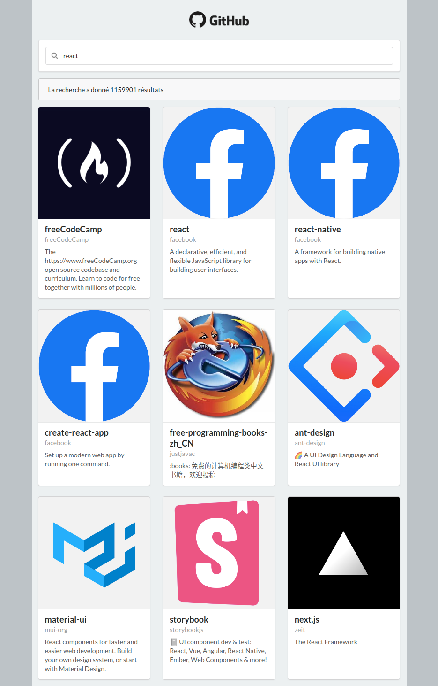

# Github API - O'CLock

Dans le cadre de ma formation chez O'Clock, mais surtout de la spécialisation React, j'ai dû faire ce challenge en l'espace d'une journée.

|        Résultat attendu        |             Résultat Final             |
| :----------------------------: | :------------------------------------: |
|  |  |

Lien vers le résultat final : [ICI](https://github-api.matthieu-munoz.fr)

**Objectif**

Je devais effectuer en autonomie un annuaire qui permette de chercher des repos sur GitHub, pour cela l'API Github était fourni.

Github fourni une API qui permet de chercher dans tous les repos, à cette adresse:

***

https://api.github.com/search/repositories?q=REPOACHERCHER&sort=stars&order=desc&page=1&per_page=9

***

### Choix des technologies

Ce challenge était l'occasion d'appliquer les notions vu en formation sur React ainsi que Sass.
J'ai choisi d'apprendre et donc d'utiliser la bibliothèque : [Semantic-UI](https://react.semantic-ui.com/) pour la mise en forme.
L'occasion était parfaite pour introduire aussi l'utilisation de react-router-dom !

### Détails

Mon architecture de projet a beaucoup évolué durant ce challenge, encore aujourd'hui elle mériterait quelque modification.
Depuis mon point d'entrée index.js à la source, je charge avec react-router-dom deux routes possible : / et /faq.
Étant deux parties distinctes de l'application.

Pour la partie recherche, j'ai un découpage en quatre composants :

* **MainSearch** étant le composant principal qui chargera tous les autres
  * **SearchBar** s'occupe de la barre de recherche de repo
  * **MessageBar** affiche divers message lors de l'utilisation de la recherche, notamment, un message de succès ou d'erreur mais aussi un temps de chargement pendant les requêtes vers l'API
  * **ReposList** s'occupe de l'affichage sous forme de carte des repos. Il charge 12 repos, les autres étant accessibles par une navigation précédant/suivant

Pour la partie À propos, c'est bien plus simple (pour le moment), j'ai un composant FAQ qui affiche un accordéons de FAQ et un composant ProfilCard pour mon profil.

### Amélioration

Je pense pouvoir être plus rigoureux dans le nommage de mes props/state/composants, ainsi que de mieux ranger et optimiser mon code.
Notamment le css qui est encore un peu en bazar.
